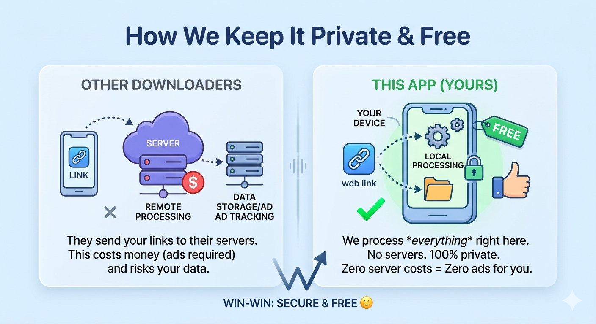
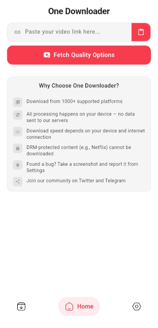

# ⚡ One Downloader Pro

**One Downloader** is a lightweight app for quick audio/video downloads from **1000+ platforms**, including **Facebook**, **Twitter**, **TeraBox**, and **TikTok**.  
Simple, clean, and ad-free, it lets you save videos to your gallery with just **one click**! 

---

## ✨ Key Features
- **1000+ Platforms:** Download from YouTube, Instagram, Pinterest, and 1000+ websites 
- **Audio or Video:** Download full videos or extract audio only 
- **Multiple Qualities:** Choose from 144p, 720p, 1080p, and more 🎬  
- **One-Tap Download:** Just copy, paste, and save directly to your gallery   
- **Free, Ad-Free & Private:** No ads, no tracking—everything runs on your device 

---

## 🔑 How It Works

---

## 💾 How to Use

### 📋 Copy & Paste Method:
1. Copy the video link you want to download.  
2. Open **One Downloader**.  
3. Paste the link and press the download button.  
4. Select format & quality.  
5. Your download will start automatically.  

---

### 🔗 Share-to-Download Method:
1. Tap the **Share** button on any platform.  
2. Select **One Downloader** from the share menu.  
3. The app will automatically grab the link and open.  
4. Select your desired format and quality.  
5. Your download will start automatically.  

---

## 📸 Screenshots

---

## 🌟 Love It? Improve It!
Join our Telegram community and share your experience and suggestions. We’d love to hear from you! 💬  

Let’s create something awesome together! 🚀